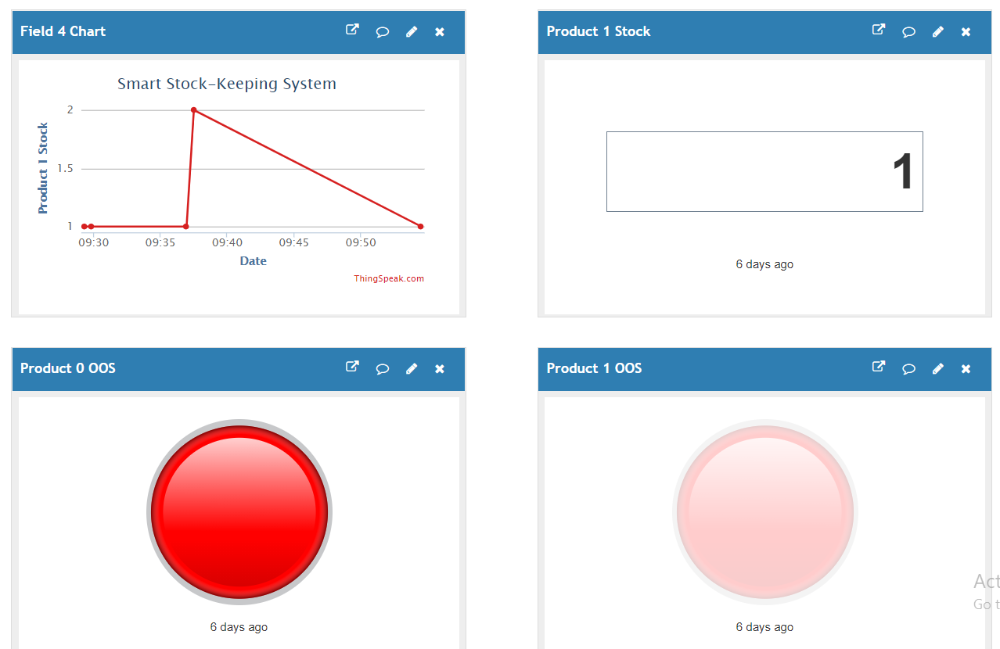

# Smart-Stock-keeping-System
School Project : Using Arduino mega and Arduino Micro to do the stock-keeping system for the retail industry

Project: Code for Arduino Mega

Project_micro: Code for Arduino Micro

Web: code for the website

